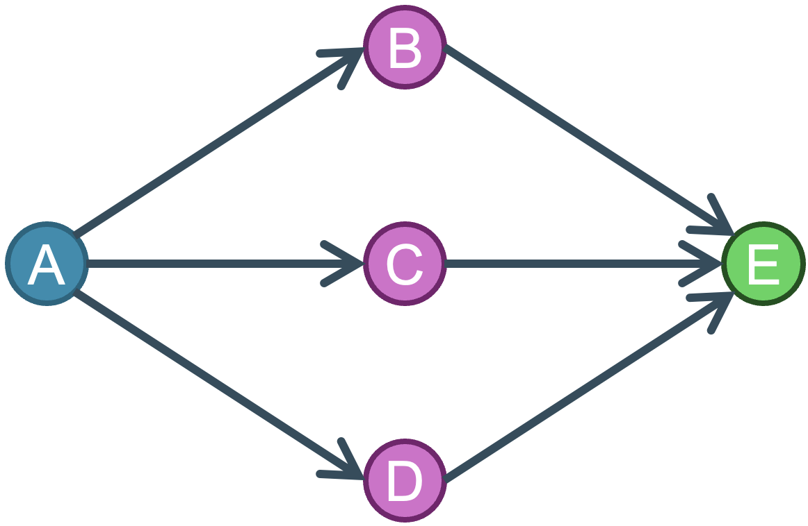

# **GARG-AML:** *finding smurfing using Graph-Aided Risk Guarding for Anti-Money Laundering* </br><sub><sub>*Bruno Deprez, Bart Baesens, Tim Verdonck, Wouter Verbeke* </sub></sub>

[](https://opensource.org/licenses/MIT)

This is the source code for an experiment to detect smurfing patterns in transaction networks. It provides an implementation of GARG-AML, which constructs a score based on the adjancy matrix of the second-order neighbourhood. 

## Methodology
GARG-AML is based on insights derived from the definition of a pure smurfing pattern. With smurfing, multiple intermediate money mules (or smurfs) are used to get a large amount of money from one account to another, often using many small transactions. A representation of this is given in the figure below. 



Translating this figure into a adjacency matrix for the second order neighbourhood, gives us the following:
$$\begin{array}{r}
        A \\ E \\ B \\ C \\ D
    \end{array}
    \begin{pmatrix}
         0 & 0 & 1 &1 &1\\
         0 & 0 & 1 &1 &1\\
         1 & 1 & 0 &0 &0 \\
         1 & 1 & 0 &0 &0 \\
         1 & 1 & 0 &0 &0 \\
    \end{pmatrix}$$

We can clearly distinguish four blocks in the adjacency matrix. For a typical smurfing pattern, the on-diagonal blocks only contain $0$, while the off-diagonal blocks are fully populated with $1$'s. The GARG-AML scores are calculated based on the density of these blocks. 

## Data 
The experiments are evaluated on synthetic data which is made publically available. 

The repository does not provide any data, due to size constraints. The data can be found online using the following link:
- [IBM Transactions for Anti Money Laundering (AML)](https://www.kaggle.com/datasets/ealtman2019/ibm-transactions-for-anti-money-laundering-aml)

## Experimental Evaluation
GARG-AML is tested against the current state-of-the-art, namely Flowscope [1] and AutoAudit [2]. The code of these two models is taken from the respective repositories and not included in this one. We refer the interested coder to the corresponding forked repositories for [Flowscope](https://github.com/B-Deprez/flowscope) and [AutoAudit](https://github.com/B-Deprez/AutoAudit), which include changes made to analyse the data sets included in this study. The code for analysing the output of the SOTA on the other hand is provided. 

## Repository structure
```
src/
  data/                       # data loading & generation
    graph_construction.py     #   transaction CSV -> NetworkX graph
    pattern_construction.py   #   parse *_Patterns.txt into per-node AML labels
    synthetic_smurfing.py     #   generate synthetic graphs with injected smurfing
    dataprep_vsc.py           #   split/recombine the large LI-Large CSV
  methods/
    GARGAML.py                # core: per-node block measures + GARG-AML score
    gargaml_scores.py         # turn block measures into summary scores
    utils/                    #   block-density measures (directed & undirected),
                              #   node ordering and neighbourhood statistics
  utils/
    graph_processing.py       # Louvain community filtering & hub removal

scripts/                      # runnable entry points (run from the repo root)
  gargaml_directed.py         #   compute directed measures on IBM data
  gargaml_undirected.py       #   undirected variant
  gargaml_*_synth.py          #   same, on the synthetic dataset grid
  gargaml_tree*.py            #   train/evaluate decision-tree & boosting models
  gargaml_IF.py               #   isolation-forest (unsupervised) variant
  gargaml_link_label.py       #   edge-/link-level labelling
  distribution_scores.py      #   score-distribution analysis

notebooks/                    # exploratory analysis and paper figures
assets/                       # README images
data/                         # datasets (not tracked — see "Data" above)
results/, res/                # generated outputs (not tracked)
```

The typical workflow is two-staged: a `gargaml_*` script computes the GARG-AML
block measures and writes them to `results/<dataset>_GARGAML_<dir>.csv`, then a
`gargaml_tree*` / `gargaml_IF` script reads those scores back to train and
evaluate a classifier. Run every script from the repository root. See
[`CLAUDE.md`](./CLAUDE.md) for a fuller description of the method, data flow,
and conventions.

## Installing 
We have provided a `requirements.txt` file:
```bash
pip install -r requirements.txt
```
Please use the above in a newly created virtual environment to avoid clashing dependencies.

## Citing
Please cite our paper and/or code as follows:
*Use the BibTeX citation*

```tex

@article{deprez2025gargamlsmurfingscalableinterpretable,
      title={GARG-AML against Smurfing: A Scalable and Interpretable Graph-Based Framework for Anti-Money Laundering}, 
      author={Bruno Deprez and Bart Baesens and Tim Verdonck and Wouter Verbeke},
      year={2025},
      journal={arXiv preprint arXiv:2506.04292},
      eprint={2506.04292},
      archivePrefix={arXiv},
      primaryClass={cs.SI},
      url={https://arxiv.org/abs/2506.04292}, 
}

```

## References
[1] Li, X., Liu, S., Li, Z., Han, X., Shi, C., Hooi, B., ... & Cheng, X. (2020). Flowscope: Spotting money laundering based on graphs. In Proceedings of the AAAI conference on artificial intelligence (Vol. 34, No. 04, pp. 4731-4738).

[2] Lee, M. C., Zhao, Y., Wang, A., Liang, P. J., Akoglu, L., Tseng, V. S., & Faloutsos, C. (2020). Autoaudit: Mining accounting and time-evolving graphs. In 2020 IEEE International Conference on Big Data (Big Data) (pp. 950-956). IEEE.
